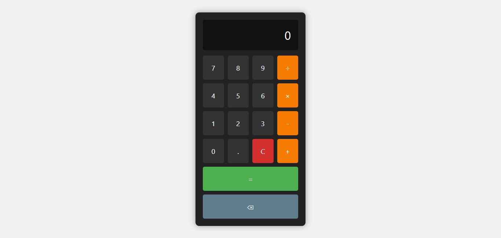

# 🧮 JavaScript Calculator

A responsive and user-friendly calculator built with **HTML**, **CSS**, and **JavaScript**. This application performs basic arithmetic operations and handles various edge cases to ensure a smooth user experience.

---

## 📸 Screenshot



---

## 📖 Description

This project is a simple calculator that allows users to perform basic arithmetic operations such as addition, subtraction, multiplication, and division. It features a clean and intuitive interface, making it easy for users to input numbers and operations. The calculator also includes functionalities like clear, backspace, and decimal input, ensuring comprehensive usability.

---

## ✨ Features

- **Basic Operations**: Perform addition, subtraction, multiplication, and division.
- **Chained Calculations**: Supports sequential operations without needing to press the equals button after each operation.
- **Decimal Support**: Allows input and calculation of decimal numbers.
- **Input Validation**: Prevents multiple decimal points in a single number and handles division by zero gracefully.
- **Clear Functionality**: Resets the calculator to its initial state.
- **Backspace Functionality**: Allows users to delete the last entered digit.

---

## 🛠️ Built With

- **HTML5**: Structure of the calculator.
- **CSS3**: Styling and layout using Flexbox for responsiveness.
- **JavaScript (ES6)**: Functionality and logic handling for calculator operations.

---

## 🚀 How to Use

1. **Clone the Repository**:
   ```
   git clone https://github.com/FrontEndExplorer-Temp/basic-calculator.git
   ```
2. **Navigate to the Project Directory**:
   ```
   cd basic_calculator
   ```
3. **Open `index.html` in Your Browser**:
   - You can double-click the `index.html` file, or
   - Use a live server extension if you're using a code editor like VS Code.

---

## 📂 Project Structure

```
basic_calculator/
├── index.html
├── style.css
├── script.js
└── images/
    └── screenshot.png
```

---
